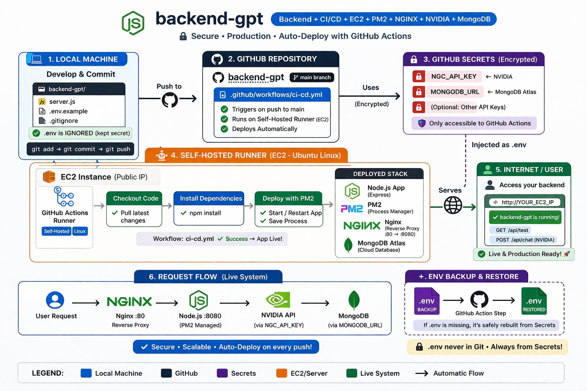

# Backend-GPT

Backend project with CI/CD using GitHub Actions, EC2, PM2, NGINX, and MongoDB.

---

## 📌 Architecture Overview



---

## 🚀 How It Works

1. Developer pushes code to GitHub
2. GitHub Actions triggers CI/CD pipeline
3. Self-hosted runner on EC2 pulls latest code
4. Secrets are injected into `.env`
5. App is restarted using PM2
6. NGINX serves traffic to Node.js backend
7. Backend connects to MongoDB and NVIDIA API

---

## ⚙️ Tech Stack

- Node.js (Express)
- PM2 (Process Manager)
- NGINX (Reverse Proxy)
- MongoDB Atlas
- GitHub Actions (CI/CD)
- NVIDIA API (NGC)

---

## 🔐 Environment Variables

```env
NGC_API_KEY=my_key
MONGODB_URL=my_url
PORT=8080
